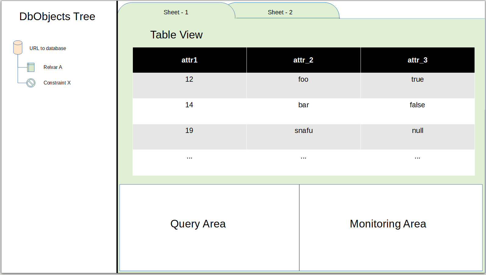

# Software requirements specification (SRS)

## The purpose of the application

To provide a gui application for relational data administration for David DBMS.
David is a relational DBMS designed by me.
I recently wrote a simple client program for it called Sling that takes care of communication over network between a client and David server.
So in this project I will build a gui app that uses Sling to communicate with David.

## Users

Bow connects to a David server using credentials and it is up to David to determine the user rights. So Bow has only one type of user who connects to one or more servers using different credentials.

## Draft of the user interface

Here is a preliminary draft of the user interface.

Sovellus aukeaa kirjautumisnäkymään, josta on mahdollista siirtyä uuden käyttäjän luomisnäkymään tai onnistuneen kirjautumisen yhteydessä kirjaantuneen käyttäjän tehtävälistaan.

## Perusversion tarjoama toiminnallisuus

### Ennen kirjautumista

- käyttäjä voi luoda järjestelmään käyttäjätunnuksen
  - käyttäjätunnuksen täytyy olla uniikki ja pituudeltaan vähintään 3 merkkiä

- käyttäjä voi kirjautua järjestelmään
  - kirjautuminen onnistuu syötettäessä olemassaoleva käyttäjätunnus kirjautumislomakkeelle
  - jos käyttäjää ei olemassa, ilmoittaa järjestelmä tästä

### Kirjautumisen jälkeen

- käyttäjä näkee omat tekemättömät työt eli _todot_

- käyttäjä voi luoda uuden todon
  - luou todo näkyy ainoastaan sen luoneelle käyttäjälle

- käyttäjä voi merkitä todon tehdyksi, jolloin todo häviää listalta

- käyttäjä voi kirjautua ulos järjestelmästä

## Jatkokehitysideoita

Perusversion jälkeen järjestelmää täydennetään ajan salliessa esim. seuraavilla toiminnallisuuksilla

- tehdyksi merkittyjen todojen tarkastelu
- tehdyksi merkittyjen todojen merkkaaminen tekemättömiksi
- todon tietojen editointi
- todojen järjestely tärkeysjärjestykseen
- todojen määrittely muille käyttäjille
- käyttäjätiimit, jotka näkevät kaikki yhteiset todot
- mahdollisuus useampaan erilliseen todo-listaan
- lisätään todoon kenttä, johon on mahdollista merkitä tarkempia todoon liittyviä tietoja
- käyttäjien yhteyteen salasana, joka vaaditaan kirjautuessa
- käyttäjätunnuksen (ja siihen liittyvien todojen) poisto
